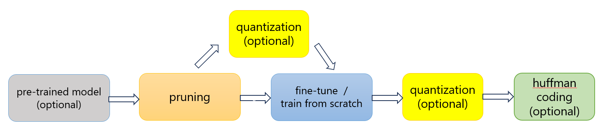
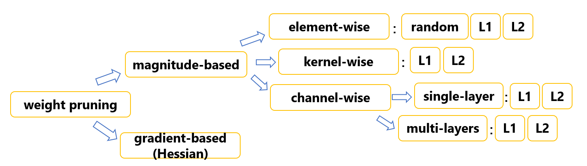
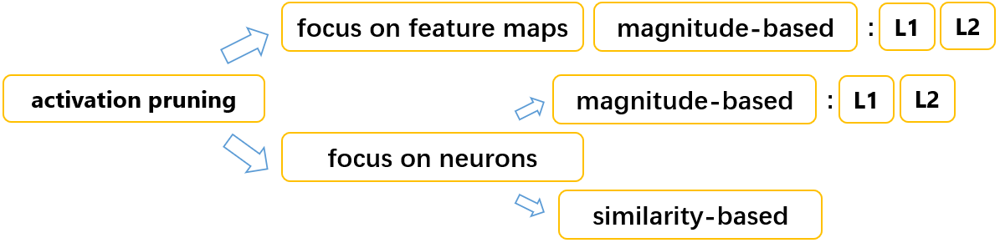

We have developed a "trainable" pruning pipeline which could automatically prunes and compresses the network, while achieving comparable performance after training.

It mainly consists of four parts: **pruning, quantization, training, and Huffman Coding**. Each part is implemented by an independent pass in the transform, which makes the pruning process flexible as we can select and combine passes as needed.

The following is our pipeline:



Please execute all of our programs in the **machop(i.e."mase/machop")** directory.

Our test function is **"test_group3.py"** inside the existing testing framework, run in command line using:
```yaml
python test/passes/graph/transforms/prune/test_group3.py
```

You might change configuration as you wish. As there are too many configurations, we kept them inside toml file at "configs/example/prune_retrain_group3.toml". 
Please refer to the file for the default parameter values.

You can also execute the transform function via the command line using 
```yaml
./ch transform --config configs/examples/vgg_cifar10_prune_retrain.toml
```

Based on the pruning target, we classify it into weight pruning and activation pruning. Here are all the methods for each:
weight pruning:


Activation pruning:


您可于**pruning_methods.py**中选择您想要的pruning method


